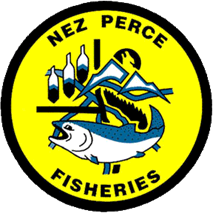

<!-- the following inserts the NPT logo into header and sets a watermark -->
```{=html}

<div class="logo-wrapper no-print-screen">
  
  
</div>

<!---->
<!---->
<!--<div class="watermark">DRAFT</div>-->
```


```{r setup, include=FALSE}
knitr::opts_chunk$set(
  echo = FALSE,
  warning = FALSE,
  message = FALSE)

library(tidyverse)
library(MARSS)
library(knitr)
library(kableExtra)
```

<div style="margin-top: 1em; font-style: italic; font-size:1.0em;">
<b>Suggested Citation for Annual Results:</b> <br>
Hesse, J.A. and Kinzer, R.N., 2026. Snake River Anadromous Fish Status: Quasi-Extinction Threshold Analysis. Department of Fisheries Resources Management. Version: `r format(Sys.Date(), '%d %B, %Y')`. Available: https://ryankinzer.github.io/SRAFS/
</div>


<button class="no-print" onclick="window.print()">Print This Page</button>


# Quasi-Extinction Summary

```{r proj-path}
yr <- 2025
fig_path <- here::here('figures',yr,'/')
source('../R/summarize_qet_risk.R')
```

Updates for the `r yr` analysis:

- Removed Little Salmon River from spring/summer Chinook Salmon analysis due to limited data from only a small portion of the population.
- Included multiple time-series of observations for each population if available (i.e, spawning ground survey data, weir observations, PIT-tag based estimates)
- Performed model selection on multiple candidate models with varying numbers of state processes, drift, process error, and observation error parameters
- PIT-tag based estimates now include an expansion for available habitat not covered by the instream PIT-tag detection system (Ackerman et al. 2026, in prep)

## Spring/summer Chinook Salmon

```{r chn-lgr, fig.cap = 'Natural-origin (wild) and hatchery-origin returns of Snake River spring/summer Chinook Salmon past Lower Granite Dam.'}
include_graphics(paste0(fig_path,'Chinook_salmon/','Chinook_salmon_Spring_summer_lgr_',yr,'.png'))
```


```{r chn-create-dataset}
spp <-'Chinook salmon'
load(paste0('../data/output/',yr,'/',gsub(' ', '_', spp), '_summary_data_',yr,'.rda'))
```

```{r chn-summary, tab.cap = 'The table provides summary counts of spring/summer Chinook salmon populations currently below minimum abundance thresholds, 50 spawners, and meeting the quasi-extinction threshold (4 consecutive years below 50 spawners), and the number of populations predicted to fall below 50 by return year 2030.' }
# 1) All populations
sum_all <- summarize_qet_risk(dat, "All Snake River Populations", yr)

# 2) ESA-listed extant only (tweak the filter to match your 'status' values)
esa_extant <- dat %>%
  filter(status != 'Extirpated')

sum_esa <- summarize_qet_risk(esa_extant, "Extant ESA-listed Populations", yr)

summary_table <- bind_rows(sum_all, sum_esa) %>%
  mutate(Populations = n_pops,
         `Below Minimum Abundance Threshold` = paste0(n_below_mat, ' (',round(pct_below_mat*100),'%)'),
         `Current Return Below 50` = paste0(n_below_50, ' (',round(pct_below_50*100),'%)'),
         `Currently Below Quasi-Extinction Threshold` = paste0(n_qet, ' (',round(pct_qet*100),'%)'),
         `Predicted Below 50 by 2030` = paste0(n_pred_below_50, ' (',round(pct_pred_below_50*100),'%)')
         ) %>%
  select(group, Populations, `Below Minimum Abundance Threshold`, `Current Return Below 50`, `Currently Below Quasi-Extinction Threshold`, `Predicted Below 50 by 2030`)
  

summary_table %>%
  mutate(Populations = as.character(Populations)) %>%
  pivot_longer(-group, names_to = 'Metric', values_to = 'value') %>%
  pivot_wider(names_from = group, values_from = value) %>%
  kable()
```


```{r chn-qet-map, fig.cap = 'Current status of natural-origin Snake River spring/summer Chinook Salmon relative to the quasi-extinction threshold (QET) and Columbia Basin Partnership goals.'}
#
include_graphics(paste0(fig_path,'Chinook_salmon/','Chinook_salmon_map_',yr,'.png'))
```

```{r chn-sa-slope, fig.cap = 'Estimated slope parameters for natural-origin Snake River spring/summer Chinook Salmon abundance trends indicate an average annual growth rate of approximately 0% for the last 10-years, however, considerable variability exists across major population groups.'}
#
include_graphics(paste0(fig_path,'Chinook_salmon/','Chinook_salmon_slope_',yr,'.png'))
```

## Summer Steelhead

```{r sth-lgr, fig.cap = 'Natural-origin (wild) and hatchery-origin returns of Snake River summer steelhead past Lower Granite Dam.'}
include_graphics(paste0(fig_path,'Steelhead/','Steelhead_Summer_lgr_',yr,'.png'))
```

```{r sth-create-dataset}
spp <-'Steelhead'
load(paste0('../data/output/',yr,'/',gsub(' ', '_', spp), '_summary_data_',yr,'.rda'))


dat <- bind_rows(
  mod_dat %>%
    select(mpg, pop, spawningyear, estimate = exp_fit),
  new_dat %>%
    select(mpg, pop, spawningyear, estimate = ests)
  ) %>%
  left_join(
    mgt_targets %>%
      select(pop, status, CBP_goals, target) %>%
      pivot_wider(names_from = CBP_goals, values_from = target)
  ) %>%
  mutate(abund_cat = case_when(
    estimate >= `Healthy and Harvestable` ~ "Healthy and Harvestable",
    estimate >= `Minimum Viable Abundance` ~ "Above Minimum Viable Abundance (MAT)",
    estimate >= `Quasi-Extinction (50 spawners)` ~ "Critical Abundance (Below MAT)",
    estimate < `Quasi-Extinction (50 spawners)` ~ "Quasi-Extinction (<50 spawners)",
    TRUE ~ NA_character_
  ))
```

```{r sth-summary, tab.cap = 'The table provides summary counts of steelhead populations currently below minimum abundance thresholds, 50 spawners, and meeting the quasi-extinction threshold (4 consecutive years below 50 spawners), and the number of populations predicted to fall below 50 by return year 2030.' }
# 1) All populations
sum_all <- summarize_qet_risk(dat, "All Snake River Populations", yr)

# 2) ESA-listed extant only (tweak the filter to match your 'status' values)
esa_extant <- dat %>%
  filter(status == 'Extant')

sum_esa <- summarize_qet_risk(esa_extant, "Extant ESA-listed Populations", yr)

summary_table <- bind_rows(sum_all, sum_esa) %>%
  mutate(Populations = n_pops,
         `Below Minimum Abundance Threshold` = paste0(n_below_mat, ' (',round(pct_below_mat*100),'%)'),
         `Current Return Below 50` = paste0(n_below_50, ' (',round(pct_below_50*100),'%)'),
         `Currently Below Quasi-Extinction Threshold` = paste0(n_qet, ' (',round(pct_qet*100),'%)'),
         `Predicted Below 50 by 2030` = paste0(n_pred_below_50, ' (',round(pct_pred_below_50*100),'%)')
         ) %>%
  select(group, Populations, `Below Minimum Abundance Threshold`, `Current Return Below 50`, `Currently Below Quasi-Extinction Threshold`, `Predicted Below 50 by 2030`)
  

summary_table %>%
  mutate(Populations = as.character(Populations)) %>%
  pivot_longer(-group, names_to = 'Metric', values_to = 'value') %>%
  pivot_wider(names_from = group, values_from = value) %>%
  kable()
```


```{r sth-qet-map, fig.cap = 'Current status of natural-origin Snake River summer steelhead relative to the quasi-extinction threshold (QET) and Columbia Basin Partnership goals.'}
#
include_graphics(paste0(fig_path,'Steelhead/','Steelhead_map_',yr,'.png'))
```

```{r sth-sa-slope, fig.cap = 'Modeled abundance trends of natural-origin Snake River summer steelhead indicate an annual 3% decline for the last 10-years.'}
#
include_graphics(paste0(fig_path,'Steelhead/', 'Steelhead_slope_',yr,'.png'))
```

# Methods

## Datasets

1. **NOSAij**: derived by co-managers and downloaded from [Coordinated Assessments](https://cax.streamnet.org/) on 5/12/2026
    - Generally estimated from expanded redd counts or mark/recapture weir estimates
  
2. **Escapement**: derived from PIT-tag observations and a branch occupancy model similar to Waterhouse et al. 2020
    - Includes a time-varying component to better describe run-timings of different populations passing Lower Granite Dam
    - Estimates have been expanded to the full population using available habitat models; see Ackerman et al. 2026 (in prep)

## Data Analysis

### Multivariate Auto-Regressive State-Space Model (MARSS; Holmes et al. 2012)

\[
\begin{aligned}
\textbf{State process:} \quad
& \mathbf{x}_{t} = \mathbf{x}_{t-1} + \mathbf{u} + \mathbf{w}_t,
\quad \mathbf{w}_t \sim \mathcal{N}(0, \mathbf{Q}) \\
\\
\textbf{Observation process:} \quad
& \mathbf{y}_{t} = \mathbf{Z}\mathbf{x}_{t} + \mathbf{a} + \mathbf{v}_t,
\quad \mathbf{v}_t \sim \mathcal{N}(0, \mathbf{R})
\end{aligned}
\]

where:

- $\mathbf{x}_t$: vector of latent (unobserved) state values at time $t$
- $\mathbf{u}$: vector of state-specific drift parameters representing mean temporal trends
- $\mathbf{w}_t$: process error vector with variance-covariance matrix $\mathbf{Q}$
- $\mathbf{y}_t$: vector of observed values at time $t$
- $\mathbf{Z}$: observation matrix linking latent states to observed time series
- $\mathbf{a}$: observation intercept or bias vector
- $\mathbf{v}_t$: observation error vector with variance-covariance matrix $\mathbf{R}$

The fitted MARSS models assumed a random-walk-with-drift state process where the autoregressive coefficient matrix was fixed as $\mathbf{B} = \mathbf{I}$.

### Fitted Models

#### State Structure ($\mathbf{Z}$)

Models were fit assuming:

- A single basin-wide latent process (1 state)
- A latent process for each major population group:
  - 7 spring/summer Chinook salmon groups
  - 5 summer steelhead groups
- A latent process for each population:
  - 34 spring/summer Chinook salmon populations
  - 22 summer steelhead populations

#### Drift Parameters ($\mathbf{u}$)

- Equal drift across all state processes (1 parameter)
- State-specific drift parameters (number of parameters equals the number of state processes)

#### Process Error Structure ($\mathbf{Q}$)

- Equal variance-covariance structure:
  - shared variance parameter
  - shared covariance parameter
- Diagonal and equal variance:
  - equal variances across state processes
  - covariances fixed to zero
- Diagonal and unequal variance:
  - unique variances for each state process
  - covariances fixed to zero

#### Observation Error Structure ($\mathbf{R}$)

- Diagonal and equal variance:
  - equal observation variances across time series
  - covariances fixed to zero
- Diagonal and unequal variance:
  - unique observation variances for each time series
  - covariances fixed to zero

# Results

## Spring/summer Chinook Salmon

```{r load-chn-results}
spp <- 'Chinook salmon'
run <- 'Spring/summer'
# load model fits
load(paste0('../data/output/',yr,'/', gsub(' ','_', spp), '_model_fits_',yr,'.rda'))
```


### Observations

```{r chn-obs, tab.cap="Summary of abundance time-series used in modeling Snake River spring/summer Chinook Salmon populations (n = 52). Time-series length and data sources varied by population, with observations spanning across 15 return years; beginning in 2011 and ending in 2025. Abundance estimates were primarily based on spawning ground surveys and weir counts, with PIT-tag detections included for select populations. The 10th, 50th (median), and 90th percentiles of observed abundance values are provided to summarize distributional characteristics across years."}
dat %>%
  filter(!is.na(nosaij)) %>%
  filter(spawningyear >= 1980) %>%
  group_by(mpg, pop, method) %>%
  summarise(obs_year = paste0(min(spawningyear),'-',max(spawningyear)),
            n = n(),
            p_10 = quantile(nosaij, probs = .10),
            p_50 = quantile(nosaij, probs =  .50),
            p_90 = quantile(nosaij, probs =  .90)
            #min_nosaij = min(nosaij),
            #max_nosaij = max(nosaij),
            #avg_nosaij = mean(nosaij),
            #sd_nosaij = sd(nosaij)
            ) %>%
  mutate(method = case_when(
    method == 2 ~ 'PIT-tag',
    method == 1 ~ 'SGS and Weir')
  ) %>%
  arrange(mpg, pop) %>%
  kable(
    col.names = c('MPG', 'Population', 'Method', 'Years', '# Years', '10%', '50%', '90%'),
    booktabs = TRUE,
    digits = 0,
    label = NA
  ) %>%
  kable_classic(full_width = TRUE) %>%
  collapse_rows(columns = 1:2, valign = "top")
```


### Model Fits

```{r chn-mod-results}
# summarize model results and select best model
source('../R/summarize_ModelFits.R')

mod_tbl <- summarize_ModelFits(mod_fit = mod_fit, model_grid) %>%
  select(model_id = fit_index, Z:U, n_samps, n_params, logLik, AICc, deltaAIC) %>%
  group_by(logLik) %>%
  slice_min(AICc, n = 1, with_ties = FALSE) %>%
  ungroup() %>%
  arrange(deltaAIC)
```


```{r print-chn-results, tab.cap = "Candidate models and number of parameters fit to spring/summer Chinook Salmon time-series observations to explain Snake River abundance trends."}
mod_tbl %>%
  slice(1:10) %>%
  select(model_id, n_params, Z, U, Q, R, logLik, AICc, deltaAIC) %>%
  kable(col.names = c('Model Id', 'Total Parameters', 'Z', 'U', 'Q', 'R', 'logLik', 'AICc', '$\\Delta$AIC'),
        booktabs = TRUE, 
        digits = 2,
        escape = FALSE,
        label = NA) %>%
  kable_classic(full_width =T)
```

### State Process

```{r state-process, fig.cap = "Estimated abundance (natural-log) trends for the seven state processes (xtT) estimated from the best fitting Snake River spring/summer Chinook Salmon model (grey shading represents 95% CI's). The blue line indicates the MARSS drift parameter and the estimated annual change in abundance across the 15 years of observations."}
#
include_graphics(paste0(fig_path,gsub(' ','_', spp),'/',gsub(' ','_', spp),'_states_',yr,'.png'))
#include_graphics("C:/Users/ryank/OneDrive - nezperce365/Projects/DFRM Research Division/Abundance_Declines/figures/2024/multiple/Chinook salmon/Chinook_salmon_state_process_2024.png")
```

### Modeled Observations

```{r sa, fig.cap = 'Empirical natural-origin abundance estimates for Snake River spring/summer Chinook Salmon (points) and estimated population trends (ytT) from the best fitting model (line).'}
#
include_graphics(paste0(fig_path,gsub(' ','_', spp),'/',gsub(' ','_', spp),'_observations_',yr,'.png'))
```

### 5-Year Predictions

```{r qet-pred, fig.cap = 'Estimated and predicted population abundance trends for natural-origin Snake River Chinook Salmon. Red points and triangles indicated an estimated annual return of 50 or fewer spawners.'}
#
include_graphics(paste0(fig_path,gsub(' ','_', spp),'/',gsub(' ','_', spp),'_predictions_',yr,'.png'))
```

## Summer Steelhead

```{r load-sth-results}
spp <- 'Steelhead'
run <- 'Summer'

# load model fits
load(paste0('../data/output/',yr,'/', gsub(' ','_', spp), '_model_fits_',yr,'.rda'))
```

### Observations

```{r sth-obs, tab.cap="Summary of abundance time-series used in modeling Snake River summer steelhead populations (n = 27). Time-series length and data sources varied by population, with observations spanning across 15 return years; beginning in 2011 and ending in 2025. Abundance estimates were primarily based on PIT-tag detections, with spawning ground surveys and weir counts included for select populations. The 10th, 50th (median), and 90th percentiles of observed abundance values are provided to summarize distributional characteristics across years."}
dat %>%
  filter(!is.na(nosaij)) %>%
  filter(spawningyear >= 2010) %>%
  group_by(mpg, pop, method) %>%
  summarise(obs_year = paste0(min(spawningyear),'-',max(spawningyear)),
            n = n(),
            p_10 = quantile(nosaij, probs = .10),
            p_50 = quantile(nosaij, probs =  .50),
            p_90 = quantile(nosaij, probs =  .90)
            #min_nosaij = min(nosaij),
            #max_nosaij = max(nosaij),
            #avg_nosaij = mean(nosaij),
            #sd_nosaij = sd(nosaij)
            ) %>%
  mutate(method = case_when(
    method == 2 ~ 'PIT-tag',
    method == 1 ~ 'SGS and Weir')
  ) %>%
  arrange(mpg, pop) %>%
  kable(
    col.names = c('MPG', 'Population', 'Method', 'Years', '# Years', '10%', '50%', '90%'),
    booktabs = TRUE,
    digits = 0,
    label = NA
  ) %>%
  kable_classic(full_width = TRUE) %>%
  collapse_rows(columns = 1:2, valign = "top")
```


### Model Fits

```{r shd-summ-results}
# summarize model results and select best model
mod_tbl <- summarize_ModelFits(mod_fit = mod_fit, model_grid) %>%
  select(model_id = fit_index, Z:U, n_samps, n_params, logLik, AICc, deltaAIC) %>%
  group_by(logLik) %>%
  slice_min(AICc, n = 1, with_ties = FALSE) %>%
  ungroup() %>%
  arrange(deltaAIC)
```


```{r shd-mod-results, tab.cap = "Candidate models and number of parameters fit to summer steelhead time-series observations to explain Snake River abundance trends."}
mod_tbl %>%
  slice(1:10) %>%
  select(model_id, n_params, Z, U, Q, R, logLik, AICc, deltaAIC) %>%
  kable(col.names = c('Model Id', 'Total Parameters', 'Z', 'U', 'Q', 'R', 'logLik', 'AICc', '$\\Delta$AIC'),
        booktabs = TRUE,
        escape = FALSE,
        label = NA) %>%
  kable_classic(full_width = TRUE)
```

### State Process

```{r sth-state-process, fig.cap = "Estimated abundance (natural-log) trend for a single state process (xtT) as estimated from the best fitting Snake River summer steelhed model (grey shading represents 95% CI's). The blue line indicates the MARSS drift parameter and the estimated annual change in abundance across the 15 years of observations."}
#
include_graphics(paste0(fig_path,gsub(' ','_', spp),'/',gsub(' ','_', spp),'_states_',yr,'.png'))
#include_graphics("C:/Users/ryank/OneDrive - nezperce365/Projects/DFRM Research Division/Abundance_Declines/figures/2024/multiple/Chinook salmon/Chinook_salmon_state_process_2024.png")
```

### Modeled Observations

```{r sth-sa, fig.cap = 'Empirical natural-origin abundance estimates for Snake River summer steelhead (points) and estimated population trends (ytT) from the best fitting model (line).'}
#
include_graphics(paste0(fig_path,gsub(' ','_', spp),'/',gsub(' ','_', spp),'_observations_',yr,'.png'))
```

### 5-Year Predictions

```{r sth-qet-pred, fig.cap = 'Estimated and predicted population abundance trends for natural-origin Snake River summer steelhead. Red points and triangles indicated an estimated annual return of 50 or fewer spawners.'}
#
include_graphics(paste0(fig_path,gsub(' ','_', spp),'/',gsub(' ','_', spp),'_predictions_',yr,'.png'))
```

# Version Archive
```{r archive_list, results = 'asis'}
files <- list.files("archive", full.names = TRUE)

info <- file.info(files)

dat <- data.frame(
  File = basename(files),
  Modified = format(info$mtime, "%Y-%m-%d %H:%M")
)

dat$Link <- paste0(
  "<a href='archive/",
  dat$File,
  "' target='_blank'>Open</a>"
)

knitr::kable(
  dat[, c("File", "Modified", "Link")],
  escape = FALSE
)
```